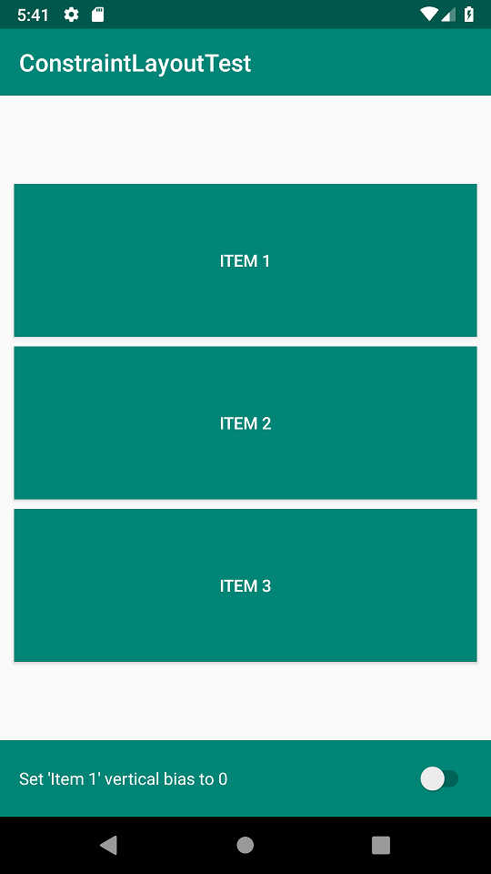
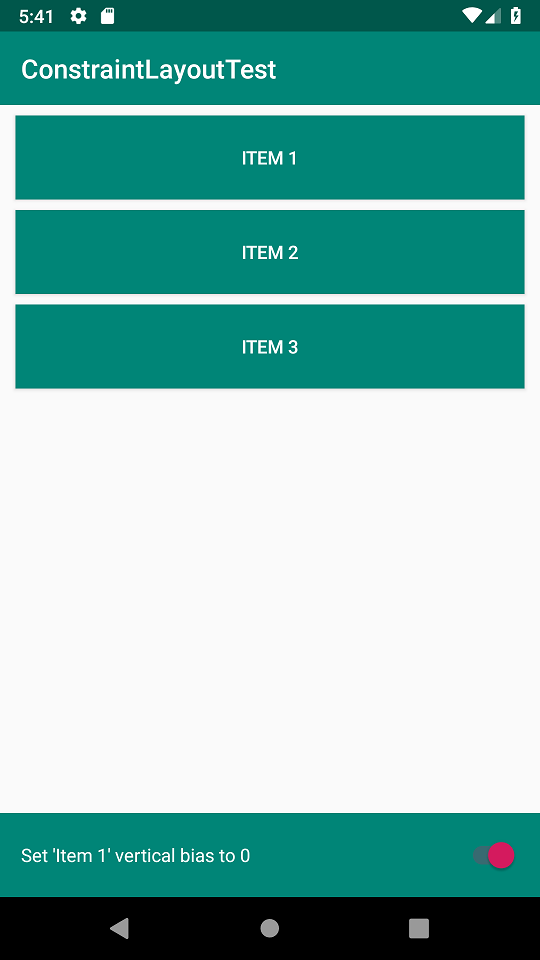

This project describes a potential issue using the ConstraintLayout component.

On a vertical chain of items defined with *layout_constraintHeight_min* and *layout_constraintHeight_max* attributes, the default behaviour is

When setting a *layout_constraintVertical_bias* to the first page item, the *layout_constraintHeight_max* attribute seems to be ignored and the visual result is  

